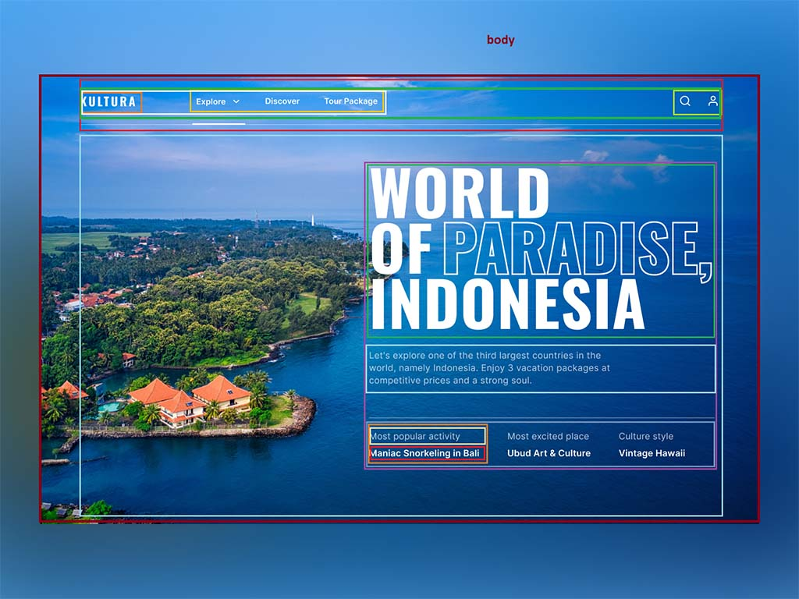

# CSS - De Maqueta a Realidad

  
  &nbsp;
  
  
  &nbsp;
  
  
Este repo provee una manera de convertir un diseño base en una página web empleando herramientas básicas.

  
  &nbsp;
  
  &nbsp;
  

## Instrucciones

1. Revisa el [diseño original](https://cdn.dribbble.com/users/1720295/screenshots/16389878/media/16c453b843a3129c7a2faa6f8dd74631.png)
2. Haz un breakdown de posibles componentes y organízalos en una jerarquía en cualquier editor de imágenes:

3. Arma el sitio web a partir de la referencia de diseño

## Recursos:
  - La [imagen de fondo](https://www.pikrepo.com/mnioq/orange-house-near-body-of-water-and-trees)
  - Puedes Investigar los fonts con capturas de pantalla en [WhatTheFont](https://www.myfonts.com/WhatTheFont/)
  - Los fonts de [Gravitica Light Demo](https://blogfonts.com/gravitica.font) y [League Gothic](https://fonts.google.com/specimen/League+Gothic?query=gothic&preview.text=KULTURA&preview.text_type=custom#standard-styles)
  - [Font Awesome 6](https://fontawesome.com/) para los íconos
  - Artículo de CSS Tricks para añadir [trazo de texto en CSS](https://css-tricks.com/adding-stroke-to-web-text/)
  - El sitio [Can I Use](https://caniuse.com/) para revisar la compatibilidad de propiedades de CSS, HTML y JS en distintos navegadores
  - [Ejercicio alterno](https://cdn3.vectorstock.com/i/1000x1000/75/42/modern-one-page-website-template-design-vector-4567542.jpg) para practicar
  - [Duelos de CSS](https://www.youtube.com/watch?v=20QiX8rmHnU) de Kevin Powell

## Extensiones recomendadas para VS Code:
  - [Live Server](https://marketplace.visualstudio.com/items?itemName=ritwickdey.LiveServer) - Para levantar un servidor local con recarga en vivo
  - [Auto Rename Tag](https://marketplace.visualstudio.com/items?itemName=formulahendry.auto-rename-tag) - Ayuda a renombrar las etiquetas de HTML
  - [indent-rainbow](https://marketplace.visualstudio.com/items?itemName=oderwat.indent-rainbow) - Añade colores a las indentaciones
  - [One Monokai Theme](https://marketplace.visualstudio.com/items?itemName=azemoh.one-monokai) - Mi tema favorito de VS Code
  - [Material Icon Theme](https://marketplace.visualstudio.com/items?itemName=PKief.material-icon-theme) - Mis íconos favoritos de VS Code
  - [Code Spell Checker](https://marketplace.visualstudio.com/items?itemName=streetsidesoftware.code-spell-checker) - Evita errores de dedo en inglés
  - [Spanish - Code Spell Checker](https://marketplace.visualstudio.com/items?itemName=streetsidesoftware.code-spell-checker-spanish) - Y para español
